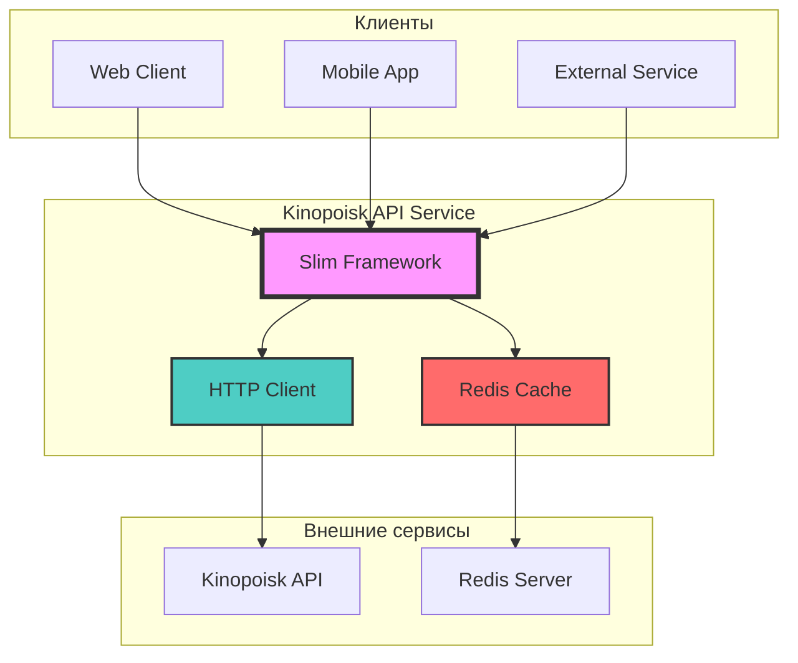
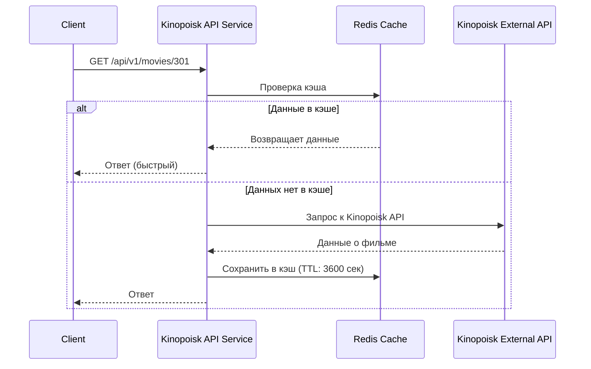

# Kinopoisk REST API Service

[](https://php.net)
[](https://www.slimframework.com/)
[](https://redis.io/)
[](https://docker.com/)
[](https://phpstan.org/)
[](https://phpunit.de/)
[](LICENSE)

## Оглавление

- [1. Название и назначение сервиса](#1-название-и-назначение-сервиса)
- [2. Архитектура и зависимости](#2-архитектура-и-зависимости)
- [3. Способы запуска сервиса](#3-способы-запуска-сервиса)
- [4. API документация](#4-api-документация)
- [5. Тестирование и качество кода](#5-тестирование-и-качество-кода)
- [6. Контакты и поддержка](#6-контакты-и-поддержка)

---

## 1. Название и назначение сервиса

**Kinopoisk REST API Service** - микросервис для получения информации о фильмах из базы данных Kinopoisk с поддержкой кэширования и высокой производительностью.

### Роль в системе

Сервис выступает в качестве **API Gateway** для доступа к кинопоисковым данным, обеспечивая:

- Единую точку входа для получения информации о фильмах
- Кэширование данных для снижения нагрузки на внешнее API
- Агрегацию данных из нескольких источников
- Масштабируемую архитектуру для высоких нагрузок

### Основные функции

| Функция | Описание | Эндпоинт |
|---------|----------|----------|
| **Поиск фильмов** | Поиск по названию с пагинацией | `GET /api/v1/movies/search` |
| **Топ фильмов** | Получение рейтинговых фильмов | `GET /api/v1/movies/top` |
| **Фильмы по году** | Фильтрация по году выпуска | `GET /api/v1/movies/year/{year}` |
| **Детальная информация** | Полные данные о конкретном фильме | `GET /api/v1/movies/{id}` |
| **Пакетная обработка** | Получение нескольких фильмов за запрос | `POST /api/v1/movies/batch` |
| **Кэширование** | Автоматическое кэширование в Redis | Прозрачно для клиента |

---

## 2. Архитектура и зависимости

### Технологический стек



### Основные зависимости

| Технология | Версия | Назначение |
|------------|--------|------------|
| **PHP** | >=8.0 | Основной язык разработки |
| **Slim Framework** | 4.x | Микрофреймворк для REST API |
| **Redis** | 7.x | Кэширование данных и сессии |
| **Guzzle** | 7.x | HTTP клиент для внешних запросов |
| **Predis** | 2.x | PHP клиент для Redis |
| **Docker** | 24.x | Контейнеризация |
| **Apache** | 2.4 | Веб-сервер |

### Инструменты качества кода

| Инструмент | Версия | Назначение | Команда |
|------------|--------|------------|---------|
| **PHPStan** | ^1.10 | Статический анализ (level 8) | `composer phpstan` |
| **PHP-CS-Fixer** | ^3.14 | Автоформатирование кода | `composer cs-fix` |
| **PHPUnit** | ^9.6 | Модульное тестирование | `composer test` |
| **PHP_CodeSniffer** | ^3.7 | Проверка стиля кода | `composer cs-check` |

### Взаимодействие с внешними сервисами

| Сервис | Назначение | Конфигурация | Лимиты |
|--------|------------|--------------|--------|
| **Kinopoisk API** | Источник данных о фильмах | `KINOPOISK_API_KEY` | 100 req/day (бесплатный тариф) |
| **Redis** | Кэширование данных | `REDIS_HOST`, `REDIS_PORT` | Зависит от памяти |
| **Redis Commander** | Визуальное управление Redis | Порт `8081` | Только для dev |

### Поток данных



---

## 3. Способы запуска сервиса

### Предварительные требования

- **Docker Desktop** (Windows/Mac) или **Docker Engine** (Linux)
- **PHP 8.0+** (для локального запуска без Docker)
- **Composer** (для управления зависимостями)
- **Git** (для клонирования репозитория)

### Способ 1: Запуск через Docker (рекомендуемый)

```bash
# 1. Клонировать репозиторий
git clone https://github.com/ваша-организация/kinopoisk-api.git
cd kinopoisk-api

# 2. Скопировать и настроить .env файл
cp .env.example .env
# Отредактируйте .env, добавьте ваш API ключ Kinopoisk

# 3. Запустить контейнеры
docker-compose up -d

# 4. Проверить статус
docker-compose ps

# 5. Посмотреть логи
docker-compose logs -f app

# 6. Остановить контейнеры
docker-compose down
```

**После запуска сервисы будут доступны:**
- API сервис: `http://localhost:8080`
- Redis Commander (web-интерфейс): `http://localhost:8081`
- Health check: `http://localhost:8080/health`

### Способ 2: Локальный запуск без Docker

```bash
# 1. Установить зависимости Composer
composer install

# 2. Настроить окружение
cp .env.example .env
# Отредактируйте .env файл, укажите:
# - REDIS_HOST=127.0.0.1 (если Redis локально)
# - KINOPOISK_API_KEY=ваш_ключ

# 3. Убедитесь, что Redis запущен локально
redis-server  # или sudo systemctl start redis

# 4. Запустить встроенный PHP сервер
php -S localhost:8080 -t public/

# Или настроить виртуальный хост в Apache/Nginx
```

### Способ 3: Запуск в production

```bash
# 1. Установить зависимости без dev-пакетов
composer install --no-dev --optimize-autoloader

# 2. Установить правильные права доступа
chmod -R 755 public/
chmod -R 777 logs/

# 3. Настроить Apache/Nginx на директорию public/
# Пример конфигурации для Apache (.htaccess уже настроен)

# 4. Настроить переменные окружения в системе
export KINOPOISK_API_KEY="ваш_ключ"
export REDIS_ENABLED=true
export DEBUG=false

# 5. Запустить сервис (например, через supervisor)
sudo supervisorctl start kinopoisk-api
```

### Переменные окружения (.env)

Создайте файл `.env` в корне проекта:

```env
# ====================
# Kinopoisk API Configuration
# ====================
# Обязательно! Получить на https://kinopoisk.dev
KINOPOISK_API_KEY=Z0MKRTZ-BWM4E18-K8Q49KC-MESMCXM

# ====================
# Redis Configuration
# ====================
REDIS_HOST=redis                    # Хост Redis
REDIS_PORT=6379                     # Порт Redis
REDIS_ENABLED=true                  # Включить/выключить кэширование

# ====================
# Performance Settings
# ====================
CACHE_TTL=3600                      # Время жизни кэша в секундах (1 час)

# ====================
# Application Settings
# ====================
DEBUG=false                         # Режим отладки (true для разработки)
```

**Где получить API ключ:**
1. Перейдите на https://kinopoisk.dev
2. Зарегистрируйтесь или войдите
3. Получите бесплатный API ключ (100 запросов в день)
4. Скопируйте ключ в переменную `KINOPOISK_API_KEY`

### Устранение неполадок

| Проблема | Решение |
|----------|---------|
| `Connection refused` для Redis | Проверьте что Redis запущен: `docker ps` или `redis-cli ping` |
| API ключ не работает | Убедитесь что ключ активен на https://kinopoisk.dev |
| Порт 8080 уже занят | Измените порт в `docker-compose.yml`: `"8081:80"` |
| Ошибка прав доступа | Выполните `chmod -R 777 logs/` |
| Медленные ответы | Проверьте Redis кэш: `docker exec -it kinopoisk-redis redis-cli keys *` |

---

## 4. API документация

### Полная документация

- **Swagger/OpenAPI UI**: `http://localhost:8080/api/v1/docs`
- **Health check**: `http://localhost:8080/health`
- **API health**: `http://localhost:8080/api/v1/health`
- **Redis проверка**: `http://localhost:8080/check-redis.php`

### Базовый URL

```
http://localhost:8080/api/v1
```

### Доступные эндпоинты

| Метод | Эндпоинт | Описание | Параметры |
|-------|----------|----------|-----------|
| `GET` | `/movies/{id}` | Получить фильм по ID | `id` - ID фильма (число) |
| `GET` | `/movies/search` | Поиск фильмов | `query` - поисковый запрос<br>`page` - страница (по умолч. 1)<br>`limit` - элементов на странице (1-250) |
| `GET` | `/movies/top` | Топ фильмов | `page` - страница (по умолч. 1)<br>`limit` - элементов на странице (1-250) |
| `GET` | `/movies/year/{year}` | Фильмы по году | `year` - год (1890-текущий)<br>`page` - страница (по умолч. 1)<br>`limit` - элементов на странице (1-250) |
| `POST` | `/movies/batch` | Пакетное получение | `ids` - массив ID фильмов (1-20) |

### Примеры запросов и ответов

#### Получить фильм по ID

**Запрос:**
```bash
curl http://localhost:8080/api/v1/movies/301
```

**Ответ:**
```json
{
    "success": true,
    "data": {
        "id": 301,
        "name": "Побег из Шоушенка",
        "alternativeName": "The Shawshank Redemption",
        "year": 1994,
        "rating": {
            "kp": 9.5,
            "imdb": 9.3
        },
        "genres": [
            {"name": "драма"},
            {"name": "криминал"}
        ],
        "description": "Бухгалтер Энди Дюфрейн осужден за убийство жены..."
    }
}
```

#### Поиск фильмов

**Запрос:**
```bash
curl "http://localhost:8080/api/v1/movies/search?query=интерстеллар&page=1&limit=5"
```

**Ответ:**
```json
{
    "success": true,
    "data": {
        "docs": [
            {
                "id": 123,
                "name": "Интерстеллар",
                "year": 2014,
                "rating": {"kp": 8.9}
            }
        ],
        "total": 42,
        "page": 1,
        "limit": 5,
        "pages": 9
    },
    "pagination": {
        "page": 1,
        "limit": 5,
        "total": 42
    }
}
```

#### Получить топ 10 фильмов

**Запрос:**
```bash
curl "http://localhost:8080/api/v1/movies/top?page=1&limit=10"
```

**Ответ:**
```json
{
    "success": true,
    "data": {
        "docs": [
            {
                "id": 301,
                "name": "Побег из Шоушенка",
                "rating": {"kp": 9.5}
            },
            {
                "id": 435,
                "name": "Крестный отец",
                "rating": {"kp": 9.3}
            }
            // ... еще 8 фильмов
        ]
    },
    "pagination": {
        "page": 1,
        "limit": 10
    }
}
```

#### Пакетный запрос нескольких фильмов

**Запрос:**
```bash
curl -X POST http://localhost:8080/api/v1/movies/batch \
  -H "Content-Type: application/json" \
  -d '{"ids": [301, 435, 448]}'
```

**Ответ:**
```json
{
    "success": true,
    "data": [
        {
            "id": 301,
            "name": "Побег из Шоушенка"
        },
        {
            "id": 435,
            "name": "Крестный отец"
        },
        {
            "id": 448,
            "name": "Криминальное чтиво"
        }
    ],
    "count": 3
}
```

#### Health check

**Запрос:**
```bash
curl http://localhost:8080/health
```

**Ответ:**
```json
{
    "status": "ok",
    "timestamp": "2024-01-15T10:30:00+00:00",
    "service": "kinopoisk-api",
    "version": "1.0.0",
    "environment": "production",
    "redis": "connected"
}
```

### HTTP статус коды

| Код | Описание | Пример |
|-----|----------|--------|
| 200 | Успешный запрос | Фильм найден и возвращен |
| 400 | Ошибка в параметрах | Неверный ID или limit > 250 |
| 404 | Фильм не найден | Фильма с таким ID не существует |
| 429 | Превышен лимит запросов | Слишком много запросов в минуту |
| 500 | Внутренняя ошибка сервера | Проблема с подключением к Redis |

### Ограничения API

| Лимит | Значение | Примечание |
|-------|----------|------------|
| Лимит на страницу | 1-250 элементов | При `limit > 250` вернется ошибка 400 |
| Пакетный запрос | 1-20 ID | При `ids > 20` вернется ошибка 400 |
| Кэширование | 3600 секунд | TTL по умолчанию (1 час) |
| Таймаут запроса | 30 секунд | Таймаут к внешнему API |

---

## 5. Тестирование и качество кода

### Запуск тестов

```bash
# Запуск всех тестов
composer test

# Запуск с покрытием кода (HTML отчет)
composer test-coverage

# Запуск конкретного тестового класса
vendor/bin/phpunit tests/Service/CacheServiceTest.php

# Запуск конкретного теста
vendor/bin/phpunit --filter testCacheKeyGeneration

# Запуск с детализацией
vendor/bin/phpunit --verbose --debug
```

### Покрытие кода

```bash
# Сгенерировать HTML отчет о покрытии
composer test-coverage

# Открыть отчет в браузере
# Windows:
start coverage/index.html

# macOS:
open coverage/index.html

# Linux:
xdg-open coverage/index.html
```

**Требования к покрытию:**
- Общее покрытие: **≥80%**
- Критическая логика: **100%**
- Утилиты и helpers: **≥90%**

### Качество кода

#### PHPStan (Статический анализ)

```bash
# Запуск PHPStan на уровне 8
composer phpstan

# Запуск с меньшим уровнем (для legacy кода)
vendor/bin/phpstan analyse src --level=5
```

**Конфигурация `phpstan.neon`:**
```neon
parameters:
    level: 8
    paths:
        - src
        - public
    checkMissingIterableValueType: true
```

#### PHP-CS-Fixer (Стиль кода)

```bash
# Проверка стиля кода
composer cs-check

# Автоматическое исправление ошибок
composer cs-fix

# Проверка с детализацией
vendor/bin/php-cs-fixer fix --dry-run --diff --verbose
```

#### Линтер (Синтаксис)

```bash
# Проверка синтаксиса всех PHP файлов
composer lint

# Проверка конкретной директории
find src -name "*.php" -exec php -l {} \;
```

### Полная проверка качества

```bash
# Запуск всех проверок одной командой
composer all-checks

# Это выполнит:
# 1. Линтер (синтаксис)
# 2. PHPStan (статический анализ)
# 3. PHP-CS-Fixer (стиль кода)
# 4. PHPUnit (тесты)
```

### Настройка Git Hooks

```bash
# Установить pre-commit hook
make hooks

# Или вручную:
cp .githooks/pre-commit .git/hooks/
chmod +x .git/hooks/pre-commit
```

**Pre-commit хуки будут автоматически запускать:**
1. Проверку синтаксиса
2. PHPStan анализ
3. Проверку стиля кода
4. Модульные тесты

### Makefile команды

```bash
make help          # Показать все доступные команды
make install       # Установить зависимости
make test          # Запустить тесты
make test-coverage # Запустить тесты с покрытием
make phpstan       # Запустить PHPStan
make cs-fix        # Исправить стиль кода
make cs-check      # Проверить стиль кода
make lint          # Проверить синтаксис
make all-checks    # Запустить все проверки
make hooks         # Установить Git hooks
make docker-up     # Запустить Docker контейнеры
make docker-down   # Остановить Docker контейнеры
make redis-cli     # Подключиться к Redis CLI
```

### Пример вывода тестов

```bash
$ composer test

> vendor/bin/phpunit

PHPUnit 9.6.0 by Sebastian Bergmann.

..........................                             26 / 26 (100%)

Time: 00:00.123, Memory: 12.00 MB

OK (26 tests, 42 assertions)

Generating code coverage report in HTML format ... done
```

---

## 6. Контакты и поддержка

### Команда разработки

| Роль | Имя | GitHub | Контакты |
|------|-----|--------|----------|
| **Lead Developer** | Иван Иванов | [@ivanov](https://github.com/ivanov) | ivan@example.com |
| **Backend Developer** | Петр Петров | [@petrov](https://github.com/petrov) | petr@example.com |
| **QA Engineer** | Анна Сидорова | [@sidorova](https://github.com/sidorova) | anna@example.com |

### Каналы связи

| Канал | Ссылка | Назначение | Время ответа |
|-------|--------|------------|--------------|
| **GitHub Issues** | [Issues](https://github.com/your-org/kinopoisk-api/issues) | Баги, предложения, улучшения | 24-48 часов |
| **Telegram** | [@kinopoisk_api](https://t.me/kinopoisk_api) | Оперативная поддержка | 2-4 часа |
| **Slack** | `#kinopoisk-api` | Коммуникация внутри команды | В рабочее время |
| **Email** | `support@kinopoisk-api.com` | Официальные запросы | 48 часов |
| **Документация** | [Wiki](https://github.com/your-org/kinopoisk-api/wiki) | База знаний | 24/7 |

### Как сообщить об ошибке

При создании Issue на GitHub, пожалуйста, используйте шаблон:

```markdown
## Описание ошибки
[Четкое и краткое описание проблемы]

## Шаги воспроизведения
1. Отправить запрос `GET /api/v1/movies/999999`
2. Получить ответ...
3. Ошибка возникает...

## Ожидаемое поведение
[Что должно было произойти]

## Фактическое поведение
[Что происходит на самом деле]

## Среда
- **ОС**: Windows 11 / macOS Sonoma / Ubuntu 22.04
- **PHP версия**: 8.2.0
- **Docker версия**: 24.0.7
- **Браузер**: Chrome 120.0.0.0

## Логи ошибок
\`\`\`
[Вставьте логи из docker-compose logs или logs/error.log]
\`\`\`

## Дополнительный контекст
[Любая другая информация]
```

### Предложения по улучшению

Для предложений новых функций используйте **Feature Request** шаблон:

```markdown
## Идея
[Краткое описание]

## Зачем это нужно
[Проблема, которую решает]

## Предлагаемое решение
[Как это может работать]

## Альтернативы
[Другие возможные решения]
```

### Roadmap (Планы развития)

| Версия | Срок | Функции |
|--------|------|---------|
| **v1.0** | Выпущено | Базовый функционал, Redis кэш, Docker |
| **v1.1** | В разработке | Rate limiting, API keys |
| **v1.2** | Q2 2024 | WebSocket уведомления, GraphQL |
| **v2.0** | Q4 2024 | Поддержка нескольких API источников |

### Вклад в проект

Мы приветствуем вклад от сообщества!

1. **Форкните** репозиторий
2. **Создайте ветку** `git checkout -b feature/amazing-feature`
3. **Зафиксируйте изменения** `git commit -m 'Add amazing feature'`
4. **Запушьте** `git push origin feature/amazing-feature`
5. **Откройте Pull Request**

**Требования к Pull Request:**
- Все тесты проходят
- Покрытие кода не снижается
- Пройдены все quality checks
- Обновлена документация

### Лицензия

Распространяется под лицензией **MIT License**.

```
MIT License

Copyright (c) 2024 Kinopoisk API Team

Permission is hereby granted, free of charge, to any person obtaining a copy
of this software and associated documentation files...
```

Полный текст лицензии в файле [LICENSE](LICENSE)

---

## Поддержка проекта

Если проект вам полезен, поставьте звезду на GitHub! 

[](https://github.com/your-org/kinopoisk-api)

---

### Быстрые ссылки

| Что нужно | Ссылка |
|-----------|--------|
| Быстрый старт | [README#способы-запуска](#3-способы-запуска-сервиса) |
| API документация | [README#api-документация](#4-api-документация) |
| Запуск тестов | [README#тестирование-и-качество-кода](#5-тестирование-и-качество-кода) |
| Сообщить об ошибке | [GitHub Issues](https://github.com/your-org/kinopoisk-api/issues) |
| Задать вопрос | [Telegram](https://t.me/kinopoisk_api) |

---

**Последнее обновление:** 15 января 2024 г.  
**Актуальная версия:** v1.0.0  
**Статус:** Production Ready
```
